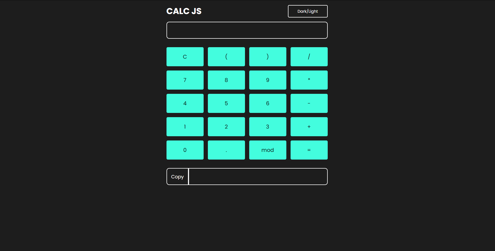

# 🧮   CALCULADORA

Projeto realizado no intuito de utilização de conceitos tais como, a utilização de grid, limitações de botoes atraves do DOM e funções de calculos simplificados atraves de funções.

[🔗 Clique aqui para acessar](https://vtssbr.github.io/Calculadora/)

# 📢 Como Utilizar 

Pode ser utilizada clicando nos botões na tela referente aos numeros e operações e tambem pode ser digitado lembrando que aceita somente valores exibidos nos botões 

# 🛠 Tecnologias 
- HTML
- CSS
- Javascript
- Git
- GitHub

